<picture>
  <source media="(prefers-reduced-motion: reduce)" srcset="./assets/hero.png" />
  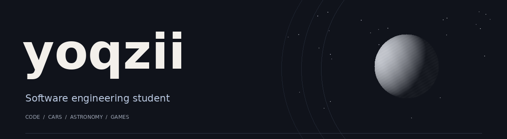
</picture>

  <a href="https://yoqzii.dev"><strong>Portfolio ↗</strong></a>&nbsp;&nbsp;-&nbsp;&nbsp;
  <a href="https://discord.gg/ScR9MGbRSY">Discord</a>&nbsp;&nbsp;-&nbsp;&nbsp;
  <a href="https://www.youtube.com/@ignYoqzii">YouTube</a>&nbsp;&nbsp;-&nbsp;&nbsp;
  <a href="https://tiktok.com/@yoqzii">TikTok</a>

 

I'm a software engineering student at **Université Laval**, currently working at **Alstom Transport Canada Inc.**

I build projects for myself and my friends. Right now, I'm learning **Java** and getting better in **C++**.

Outside of code : **cars, astronomy, and gaming**.

## Technologies & tools

**Development**

  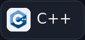
  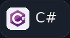
  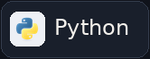
  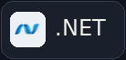
  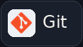
  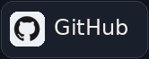
  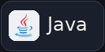
  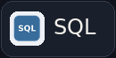

**Business applications**

  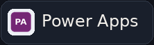
  

**Data & machine learning**

  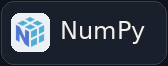
  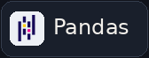
  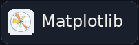
  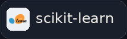
  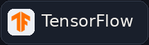
  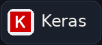

**Documentation & design**

  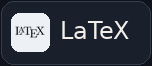
  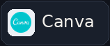
  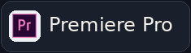

## GitHub activity

  
  

One more thing 🥉

I once won bronze in a tennis tournament. There were three players. Still counts.

